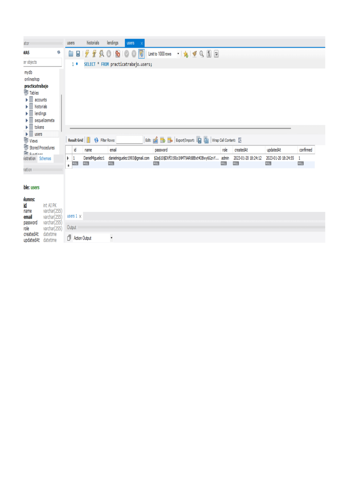
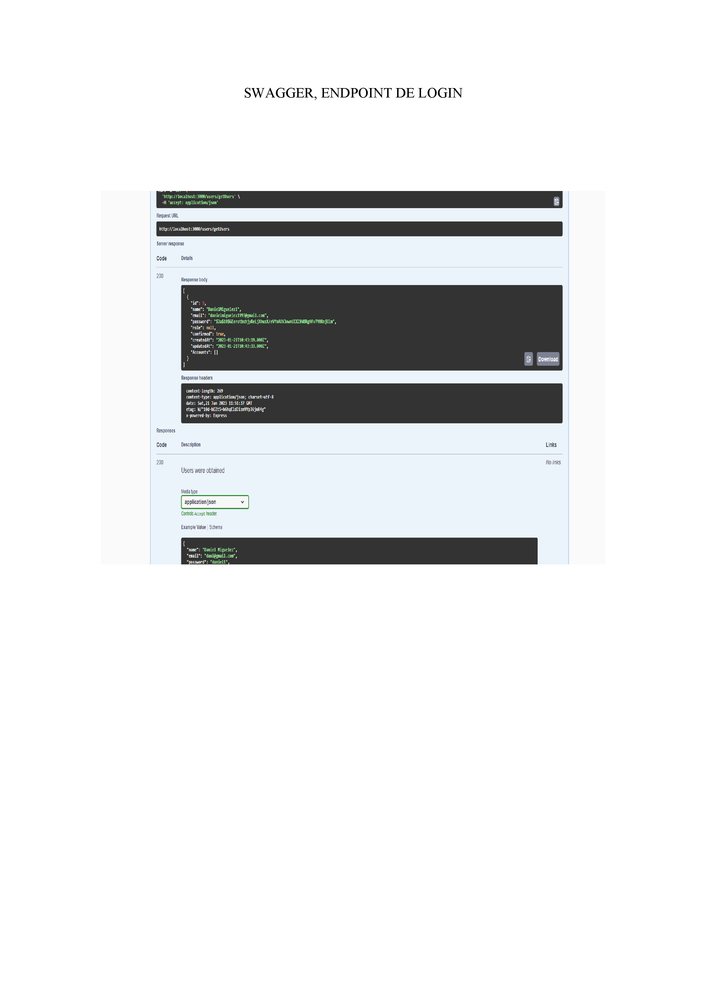
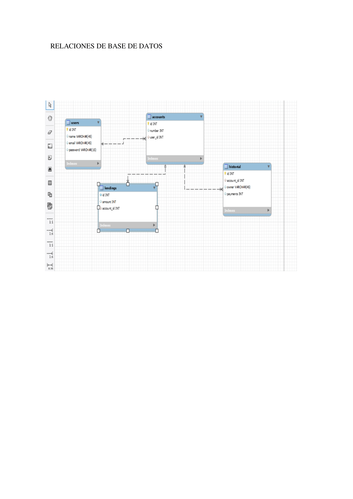

# PRUEBA TECNICA DANIEL MIGUELEZ

<h3 align="center">PRUEBA TECNICA BACKEND</h3>

En este proyecto pongo en practica los conocimientos adquiridos durante mi etapa en el bootcamp, para Jaiden de Aiudo en una prueba tecnica.

## Metas de esta prueba

### Desarrollar de un backend de un banco utilizando los siguientes ENDPOINTS:

<objectives>
  <ol>
    <li>Registro de usuarios, creacion de historiales, cuentas y prestamos.</li>
    <li>Log in and log out, users tambien confirmarlos.</a></li>
    <li>Ver usuarios y crearlos</li>
    <li>Borrar y editar endpoints, si se es Admin.</a></li>
  </ol>
</objectives>

### Requerimientos del proyecto:

• Diseñar la base de datos relacional respetiva y adjuntar una imagen del diseño en el
repositorio (Se debe documentar cada columna y cada tabla de datos, explicando
brevemente cuál es su función)

• Diseñar la arquitectura personalizada del API REST teniendo en cuenta el diseño de
base de datos previo, siguiendo las convenciones recomendadas en las buenas
prácticas.
• Elementos en Laravel: Controllers, services, models, eloquent, routing,
endpoints, etc.

• Elementos en Symfony: Controllers, services, entities, doctrine, routing,
endpoints, etc.

• Realizar toda la configuración necesaria para que API REST sea un API privada y
construir el sistema de autentificación y acceso.

• Crear el sistema de reocupación de contraseña dentro del API.

• Crear la documentación respectiva del API REST, la cual debe definir adecuadamente
la arquitectura diseñada y explicar brevemente cada componente de la estructura.
También debe estar documentado como debe conectarse al API REST un cliente (SPAs,
Móviles, etc.)

• Hacer un diagrama de procesos que muestre como fluye la información dentro del API
REST al momento de realizar una solicitud.

• Construir la colección de conexiones en el software POSTMAN para poderse conectar
al API REST. Debe adjuntar la colección en el repositorio.

• Implementar buenas prácticas de programación

• Utilizar el sistema de control de versiones GIT

• Utilizar Bitbucket (jriano@aiudo.es) o Github o Gitlab (jaidenmeiden@gmail.com) y
compartir los repositorios, incluyéndolo como Maintainer.

### POSTMAN ENLACES

#### FOR USERS 
https://lunar-space-777596.postman.co/workspace/Prueba-tecnica--Daniel~7b71701b-60cb-4298-8944-26dc5a936f97/collection/24675459-d4d0cfdc-168e-47a3-bf8f-b63b1a170676?action=share&creator=24675459

### FOR HISTORIALS
https://lunar-space-777596.postman.co/workspace/Prueba-tecnica--Daniel~7b71701b-60cb-4298-8944-26dc5a936f97/collection/24675459-51ed8ed7-f646-4c1c-82e0-3a4481557df3?action=share&creator=24675459

### FOR LENDINGS
https://lunar-space-777596.postman.co/workspace/Prueba-tecnica--Daniel~7b71701b-60cb-4298-8944-26dc5a936f97/collection/24675459-9b487ca5-8b9c-481f-a99f-ed3e85d4169d?action=share&creator=24675459

### FOR ACCOUNTS
https://lunar-space-777596.postman.co/workspace/Prueba-tecnica--Daniel~7b71701b-60cb-4298-8944-26dc5a936f97/collection/24675459-dd907feb-f411-4269-b866-29b2b216f136?action=share&creator=24675459

### Built With

- [![Node][node.js]][node.js-url]

### Mapa a futuro.

- [ ] Poner mas endpoints y mejorar el flujo.
- [ ] Poner un front a la pagina.
- [ ] Poner en practica las relaciones.

## Licencia

Esta prueba esta bajo la licencia de Daniel Miguélez.

### Vista del backend y GIF'S

### Aqui podemos ver la base de datos en el workbench..

### Aqui un endpoint documentdo en Swagger

### En el segundo, se puede ver la relacion realizada en MySQL previa al proyecto realizado..

### Gifs de postman en el que se ven varios endpoints.

.gif)

## Contacto

 

---

<!-- MARKDOWN LINKS & IMAGES -->
<!-- https://www.markdownguide.org/basic-syntax/#reference-style-links -->

[linkedin-shield]: https://img.shields.io/badge/-LinkedIn-black.svg?style=for-the-badge&logo=linkedin&colorB=555
[linkedin-url]: https://linkedin.com/in/sergiocano-dev
[product-screenshot]: images/screenshot.png
[Next.js]: https://img.shields.io/badge/next.js-000000?style=for-the-badge&logo=nextdotjs&logoColor=white
[Next-url]: https://nextjs.org/
[React.js]: https://img.shields.io/badge/React-20232A?style=for-the-badge&logo=react&logoColor=61DAFB
[React-url]: https://reactjs.org/
[Vue.js]: https://img.shields.io/badge/Vue.js-35495E?style=for-the-badge&logo=vuedotjs&logoColor=4FC08D
[Vue-url]: https://vuejs.org/
[Angular.io]: https://img.shields.io/badge/Angular-DD0031?style=for-the-badge&logo=angular&logoColor=white
[Angular-url]: https://angular.io/
[JWT]: https://img.shields.io/badge/JWT-black?style=for-the-badge&logo=JSON%20web%20tokens
[JWT-url]: https://jwt.io/
[Vercel]: https://img.shields.io/badge/vercel-%23000000.svg?style=for-the-badge&logo=vercel&logoColor=white
[Vercel-url]: https://vercel.com/
[MongoDB]: https://img.shields.io/badge/MongoDB-%234ea94b.svg?style=for-the-badge&logo=mongodb&logoColor=white
[MongoDB-url]: https://www.mongodb.com/es
[Express.js]: https://img.shields.io/badge/express.js-%23404d59.svg?style=for-the-badge&logo=express&logoColor=%2361DAFB
[Express.js-url]: https://expressjs.com/
[Node.JS]: https://img.shields.io/badge/node.js-6DA55F?style=for-the-badge&logo=node.js&logoColor=white
[Node.JS-url]: https://nodejs.org/en/
[SASS]: https://img.shields.io/badge/SASS-pink?style=for-the-badge&logo=SASS&logoColor=white
[SASS-url]: https://sass-lang.com/
[React]: https://img.shields.io/badge/React-219ebc?style=for-the-badge&logo=React&typoColor=fedcba&logoColor=white
[React-url]: https://es.reactjs.org/
[Postman]: https://img.shields.io/badge/Postman-FF6C37?style=for-the-badge&logo=postman&logoColor=white
[Postman-url]: https://www.postman.com/
